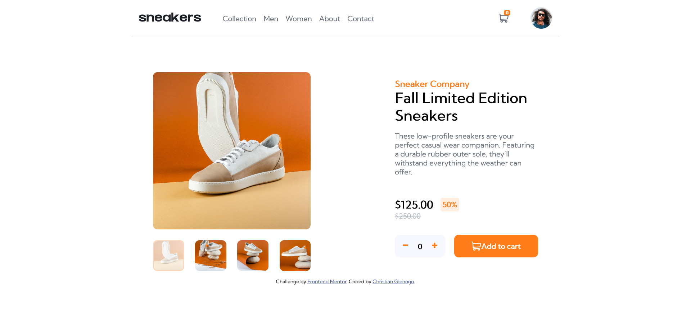

# Frontend Mentor - E-commerce product page solution

This is a solution to the [E-commerce product page challenge on Frontend Mentor](https://www.frontendmentor.io/challenges/ecommerce-product-page-UPsZ9MJp6). Frontend Mentor challenges help you improve your coding skills by building realistic projects.

## Table of contents

- [Overview](#overview)
  - [The challenge](#the-challenge)
  - [Screenshot](#screenshot)
  - [Links](#links)
- [My process](#my-process)
  - [Built with](#built-with)
  - [What I learned](#what-i-learned)
  - [Continued development](#continued-development)
  - [Useful resources](#useful-resources)
- [Author](#author)
- [Acknowledgments](#acknowledgments)

## Overview

### The challenge

Users should be able to:

- View the optimal layout for the site depending on their device's screen size
- See hover states for all interactive elements on the page
- Open a lightbox gallery by clicking on the large product image
- Switch the large product image by clicking on the small thumbnail images
- Add items to the cart
- View the cart and remove items from it

### Screenshot

### Links

- Solution URL: [Add solution URL here](https://www.frontendmentor.io/solutions/ecommerce-using-vanilla-javascript-and-scss-zhmF0OZNY)
- Live Site URL: [Add live site URL here](https://christianglenogo.github.io/E-commerce-product-page/)

## My process

### Built with

- Semantic HTML5 markup
- CSS custom properties
- SCSS
- Mobile-first workflow
- Vanilla JavaScript

### What I learned

I've learned how to change the color of svg. I used to put into the img element until i noticed that it wont change the color when hovering over it. Though it just a small thing but for me it's one of the most important to learn as basic knowledge in html and css. 

### Continued development

In the JavaScript side I still have a lot to learn specifically working on DOM. I often dependent to the others code when creating a structure. Now I spend more time to cultivate and expand more knowledge in JavaScript.

### Useful resources

- [w3school](https://www.w3schools.com/) - This website helped me to understand more of the methods and syntax.

## Author

- Frontend Mentor - [@christianglenogo](https://www.frontendmentor.io/profile/CHRISTIANGLENOGO)

## Acknowledgments

Thanks to Frontend Mentor for making this challenge you never know how amazing to have a platform like this and how helpful to us the aspirant frontend developer. Also thanks to the content creator on youtube for creating such tutorial you guys are amazing.
